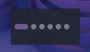

# Spatium — GNOME-style Virtual Desktop Indicator for Plasma 6

**Spatium** is a lightweight, GNOME-inspired virtual desktop switcher built specifically for **KDE Plasma 6**. It provides a clean, minimal dot-based interface to navigate your workspaces with support for custom colors, animations, and mouse-wheel scrolling.



## Features

* **Minimalist UI**: Clean dots that expand to bars for the active desktop.
* **Three dot shapes**: Choose between circle, square, or desktop name label.
* **Desktop Name mode**: Displays the actual desktop name as set in KWin (e.g. `Home`, `Documents`), falling back to the index number.
* **Highly Customizable**: Adjust dot sizes, spacing, and active dimensions.
* **Fixed dot count**: Display a fixed number of dots regardless of how many virtual desktops are active.
* **Custom Color Picker**: Pick any color via the native system color dialog or type a hex code directly (`#RRGGBB`).
* **Desktop Management**: Add or remove virtual desktops directly via the context menu.
* **Scrolling Support**: Switch desktops using the mouse wheel with optional wrap-around.
* **Plasma 6 Ready**: Uses the latest Kirigami and Plasma 6 APIs.

## Configuration
Right-click the widget and select **"Configure Spatium..."** to access all options.

| Section | Option | Description |
|---|---|---|
| Appearance | Shape | Circle, Square, or Desktop Name |
| Appearance | Dot Size | Size of inactive dots in px (disabled in Name mode) |
| Appearance | Spacing Factor | Gap between dots as a fraction of dot size |
| Appearance | Active Width/Height | Size of the active dot (disabled in Name mode) |
| Colors | Custom Colors | Enable custom color overrides |
| Colors | Active / Inactive Color | Pick via color dialog or enter a hex code |
| Behavior | Fixed Dot Count | Show a fixed number of dots |
| Behavior | Wrap Around | Wrap when scrolling past the last desktop |
| Behavior | Animation | Transition duration in milliseconds |
| Behavior | Middle Click Command | Shell command to run on middle click |
| Behavior | Desktop Management | Allow adding/removing desktops via context menu |

## Installation

### The Easy Way (Automated)
1. Clone the repository:
   ```bash
   git clone https://github.com/sakibreza229/org.kde.plasma.spatium.git
   cd org.kde.plasma.spatium
   ```

2. Run the included install script:
   ```Bash
   chmod +x install.sh
   ./install.sh
   ```

### The Manual Way
1. Ensure the metadata.json is in the root of the folder.

2. Copy the entire folder to your Plasma plasmoids directory:
   ```Bash
   cp -r org.kde.plasma.spatium ~/.local/share/plasma/plasmoids/
   ```
3. Refresh the Plasma shell:
   ```Bash
   kbuildsycoca6
   ```

## Configuration
Right-click the widget and select "Configure Spatium..."

## Requirements
- KDE Plasma 6.0+
- Plasma 5 Support (for the executable data engine)

## License
This project is licensed under the GPL-3.0+ License.
